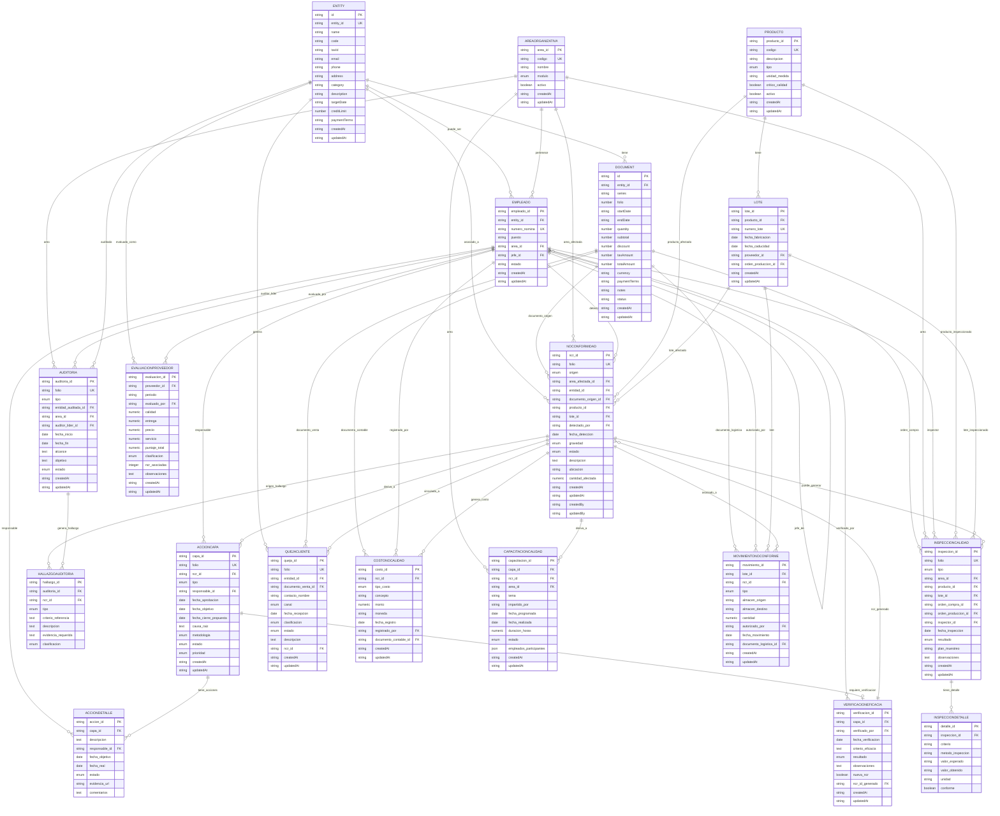

# Diagrama Entidad-Relación: Gestión de Calidad

```mermaid
erDiagram
    ENTITY {
        string id PK
        string entity_id UK
        string name
        string code
        string taxId
        string email
        string phone
        string address
        string category
        string description
        string targetDate
        number creditLimit
        string paymentTerms
        string createdAt
        string updatedAt
    }

    DOCUMENT {
        string id PK
        string entity_id FK
        string series
        number folio
        string startDate
        string endDate
        number quantity
        number subtotal
        number discount
        number taxAmount
        number totalAmount
        string currency
        string paymentTerms
        string notes
        string status
        string createdAt
        string updatedAt
    }

    AREAORGANIZATIVA {
        string area_id PK
        string codigo UK
        string nombre
        enum modulo
        boolean activo
        string createdAt
        string updatedAt
    }

    EMPLEADO {
        string empleado_id PK
        string entity_id FK
        string numero_nomina UK
        string puesto
        string area_id FK
        string jefe_id FK
        string estado
        string createdAt
        string updatedAt
    }

    PRODUCTO {
        string producto_id PK
        string codigo UK
        string descripcion
        enum tipo
        string unidad_medida
        boolean critico_calidad
        boolean activo
        string createdAt
        string updatedAt
    }

    LOTE {
        string lote_id PK
        string producto_id FK
        string numero_lote UK
        date fecha_fabricacion
        date fecha_caducidad
        string proveedor_id FK
        string orden_produccion_id FK
        string createdAt
        string updatedAt
    }

    NOCONFORMIDAD {
        string ncr_id PK
        string folio UK
        enum origen
        string area_afectada_id FK
        string entidad_id FK
        string documento_origen_id FK
        string producto_id FK
        string lote_id FK
        string detectado_por FK
        date fecha_deteccion
        enum gravedad
        enum estado
        text descripcion
        string ubicacion
        numeric cantidad_afectada
        string createdAt
        string updatedAt
        string createdBy
        string updatedBy
    }

    INSPECCIONCALIDAD {
        string inspeccion_id PK
        string folio UK
        enum tipo
        string area_id FK
        string producto_id FK
        string lote_id FK
        string orden_compra_id FK
        string orden_produccion_id FK
        string inspector_id FK
        date fecha_inspeccion
        enum resultado
        string plan_muestreo
        text observaciones
        string createdAt
        string updatedAt
    }

    INSPECCIONDETALLE {
        string detalle_id PK
        string inspeccion_id FK
        string criterio
        string metodo_inspeccion
        string valor_esperado
        string valor_obtenido
        string unidad
        boolean conforme
    }

    AUDITORIA {
        string auditoria_id PK
        string folio UK
        enum tipo
        string entidad_auditada_id FK
        string area_id FK
        string auditor_lider_id FK
        date fecha_inicio
        date fecha_fin
        text alcance
        text objetivo
        enum estado
        string createdAt
        string updatedAt
    }

    HALLAZGOAUDITORIA {
        string hallazgo_id PK
        string auditoria_id FK
        string ncr_id FK
        enum tipo
        text criterio_referencia
        text descripcion
        text evidencia_requerida
        enum clasificacion
    }

    ACCIONCAPA {
        string capa_id PK
        string folio UK
        string ncr_id FK
        enum tipo
        string responsable_id FK
        date fecha_aprobacion
        date fecha_objetivo
        date fecha_cierre_propuesta
        text causa_raiz
        enum metodologia
        enum estado
        enum prioridad
        string createdAt
        string updatedAt
    }

    ACCIONDETALLE {
        string accion_id PK
        string capa_id FK
        text descripcion
        string responsable_id FK
        date fecha_objetivo
        date fecha_real
        enum estado
        string evidencia_url
        text comentarios
    }

    VERIFICACIONEFICACIA {
        string verificacion_id PK
        string capa_id FK
        string verificado_por FK
        date fecha_verificacion
        text criterio_eficacia
        enum resultado
        text observaciones
        boolean nueva_ncr
        string ncr_id_generado FK
        string createdAt
        string updatedAt
    }

    QUEJACLIENTE {
        string queja_id PK
        string folio UK
        string entidad_id FK
        string documento_venta_id FK
        string contacto_nombre
        enum canal
        date fecha_recepcion
        enum clasificacion
        enum estado
        text descripcion
        string ncr_id FK
        string createdAt
        string updatedAt
    }

    EVALUACIONPROVEEDOR {
        string evaluacion_id PK
        string proveedor_id FK
        string periodo
        string evaluado_por FK
        numeric calidad
        numeric entrega
        numeric precio
        numeric servicio
        numeric puntaje_total
        enum clasificacion
        integer ncr_asociadas
        text observaciones
        string createdAt
        string updatedAt
    }

    COSTONOCALIDAD {
        string costo_id PK
        string ncr_id FK
        enum tipo_costo
        string concepto
        numeric monto
        string moneda
        date fecha_registro
        string registrado_por FK
        string documento_contable_id FK
        string createdAt
        string updatedAt
    }

    CAPACITACIONCALIDAD {
        string capacitacion_id PK
        string capa_id FK
        string ncr_id FK
        string area_id FK
        string tema
        string impartido_por
        date fecha_programada
        date fecha_realizada
        numeric duracion_horas
        enum estado
        json empleados_participantes
        string createdAt
        string updatedAt
    }

    MOVIMIENTONOCONFORME {
        string movimiento_id PK
        string lote_id FK
        string ncr_id FK
        enum tipo
        string almacen_origen
        string almacen_destino
        numeric cantidad
        string autorizado_por FK
        date fecha_movimiento
        string documento_logistica_id FK
        string createdAt
        string updatedAt
    }

    ENTITY ||--o{ DOCUMENT : "tiene"
    ENTITY ||--o{ NOCONFORMIDAD : "asociado_a"
    ENTITY ||--o{ QUEJACLIENTE : "genera"
    ENTITY ||--o{ EVALUACIONPROVEEDOR : "evaluado_como"
    ENTITY ||--o{ EMPLEADO : "puede_ser"

    DOCUMENT ||--o{ NOCONFORMIDAD : "documento_origen"
    DOCUMENT ||--o{ QUEJACLIENTE : "documento_venta"
    DOCUMENT ||--o{ COSTONOCALIDAD : "documento_contable"
    DOCUMENT ||--o{ MOVIMIENTONOCONFORME : "documento_logistica"
    DOCUMENT ||--o{ INSPECCIONCALIDAD : "orden_compra"

    AREAORGANIZATIVA ||--o{ EMPLEADO : "pertenece"
    AREAORGANIZATIVA ||--o{ NOCONFORMIDAD : "area_afectada"
    AREAORGANIZATIVA ||--o{ INSPECCIONCALIDAD : "area"
    AREAORGANIZATIVA ||--o{ AUDITORIA : "area"
    AREAORGANIZATIVA ||--o{ CAPACITACIONCALIDAD : "area"

    EMPLEADO ||--o{ EMPLEADO : "jefe_de"
    EMPLEADO ||--o{ NOCONFORMIDAD : "detectado_por"
    EMPLEADO ||--o{ INSPECCIONCALIDAD : "inspector"
    EMPLEADO ||--o{ AUDITORIA : "auditor_lider"
    EMPLEADO ||--o{ ACCIONCAPA : "responsable"
    EMPLEADO ||--o{ ACCIONDETALLE : "responsable"
    EMPLEADO ||--o{ VERIFICACIONEFICACIA : "verificado_por"
    EMPLEADO ||--o{ EVALUACIONPROVEEDOR : "evaluado_por"
    EMPLEADO ||--o{ COSTONOCALIDAD : "registrado_por"
    EMPLEADO ||--o{ MOVIMIENTONOCONFORME : "autorizado_por"

    PRODUCTO ||--o{ LOTE : "tiene"
    PRODUCTO ||--o{ NOCONFORMIDAD : "producto_afectado"
    PRODUCTO ||--o{ INSPECCIONCALIDAD : "producto_inspeccionado"

    LOTE ||--o{ NOCONFORMIDAD : "lote_afectado"
    LOTE ||--o{ INSPECCIONCALIDAD : "lote_inspeccionado"
    LOTE ||--o{ MOVIMIENTONOCONFORME : "lote"

    NOCONFORMIDAD ||--o{ ACCIONCAPA : "deriva_a"
    NOCONFORMIDAD ||--o{ COSTONOCALIDAD : "genera_costo"
    NOCONFORMIDAD ||--o{ QUEJACLIENTE : "vinculada_a"
    NOCONFORMIDAD ||--o{ HALLAZGOAUDITORIA : "origen_hallazgo"
    NOCONFORMIDAD ||--o{ CAPACITACIONCALIDAD : "deriva_a"
    NOCONFORMIDAD ||--o{ MOVIMIENTONOCONFORME : "asociado_a"
    NOCONFORMIDAD ||--o{ INSPECCIONCALIDAD : "puede_generar"

    INSPECCIONCALIDAD ||--o{ INSPECCIONDETALLE : "tiene_detalle"

    AUDITORIA ||--o{ HALLAZGOAUDITORIA : "genera_hallazgo"

    ACCIONCAPA ||--o{ ACCIONDETALLE : "tiene_acciones"
    ACCIONCAPA ||--o| VERIFICACIONEFICACIA : "requiere_verificacion"

    VERIFICACIONEFICACIA ||--o{ NOCONFORMIDAD : "ncr_generado"

    ENTITY ||--o{ AUDITORIA : "auditada"
```
